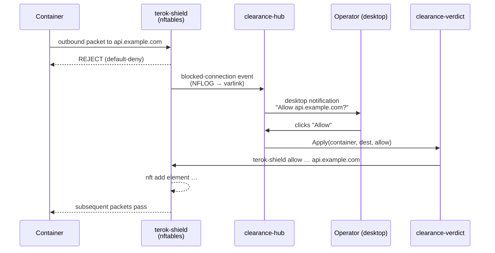

<p align="center">
  <picture>
    <source media="(prefers-color-scheme: dark)" srcset="https://terok-ai.github.io/terok/terok-logo-w.svg">
    
  </picture>
</p>

# terok-clearance

[](https://pypi.org/project/terok-clearance/)
[](https://opensource.org/licenses/Apache-2.0)
[](https://api.reuse.software/info/github.com/terok-ai/terok-clearance)
[](https://sonarcloud.io/summary/new_code?id=terok-ai_terok-clearance)

Live allow/deny prompts for the [terok-shield](https://github.com/terok-ai/terok-shield) firewall — desktop
notifications, varlink hub, verdict helper.

When a hardened terok container hits a blocked outbound destination,
the operator sees a desktop notification with **Allow** and **Deny**
buttons; the chosen verdict is written into the running container's nftables ruleset.

<p align="center">
  
</p>

## What is the clearance system

The clearance system is the operator-in-the-loop decision path for
terok's egress firewall.  It is built from a hub and verdict pair
that talk over a varlink Unix socket and surface decisions through
the freedesktop Notifications D-Bus interface:



The hub and the verdict server are composed in-process by the
per-container supervisor that ``terok-sandbox``'s OCI hook spawns —
one supervisor (and therefore one hub socket) per container.  The
hub fans events out to whichever operator UIs are subscribed (the
`terok-clearance-hub clearance` terminal tool, the embedded
`terok-tui` screen, a `DbusNotifier` posting popups on the D-Bus
session bus).  The verdict server is the only piece that execs
`terok-shield` (which reaches into the container's network
namespace), so it sits behind the hub's authz boundary and keeps
the privileged exec path isolated.

## What it provides

- **Async-first Python API** — `create_notifier()`, `Notifier`
  protocol, `DbusNotifier`, `CallbackNotifier`, `NullNotifier`
- **Varlink hub** — `ClearanceHub`, `ClearanceClient`,
  `EventSubscriber` — the subscriber API operator UIs build on
  (the TUI renders live verdicts through it)
- **Multi-socket subscriber** — `MultiSocketSubscriber` multiplexes
  every per-container hub socket under `$XDG_RUNTIME_DIR/terok/clearance/`
  so a single UI sees the union of every supervisor's event stream
- **Embeddable verdict server** — `VerdictServer` for the
  per-container supervisor to compose alongside the hub
- **Graceful degradation** — `NullNotifier` is returned when no
  D-Bus session bus is available, so headless hosts can still run
  the rest of the stack

## Where it sits in the stack

terok-clearance is the user-in-the-loop side-rail of the terok
ecosystem.  Above it,
[terok](https://github.com/terok-ai/terok)'s TUI subscribes to every
per-container hub socket to display verdicts in-band; on a desktop
session the same events fire freedesktop popups.  Below it, the
verdict server reaches into
[terok-shield](https://github.com/terok-ai/terok-shield) to mutate
the running ruleset.  Lifecycle is owned by
[terok-sandbox](https://github.com/terok-ai/terok-sandbox)'s
per-container supervisor, which composes the hub and verdict server
in-process for every container it watches.

The notification API (`create_notifier()`, the `Notifier` protocol)
is usable standalone for generic desktop-notification needs.

## Requirements

- Linux with a D-Bus session bus (any desktop environment with a
  notification daemon) — the package degrades cleanly to a no-op
  notifier when no bus is reachable
- Python 3.12+

## Installation

```bash
pip install terok-clearance
```

For most users this dependency is pulled in transitively by
`terok-sandbox`.  Install it directly only when embedding the API
in your own tooling.

## Quick start

### Send a notification

```python
import asyncio
from terok_clearance import create_notifier

async def main():
    notifier = await create_notifier(app_name="terok")
    action_received = asyncio.Event()

    def on_action(action_key):
        print(action_key)
        action_received.set()

    nid = await notifier.notify(
        "Clearance request",
        "Task alpha wants access to api.github.com:443",
        actions=[("allow", "Allow"), ("deny", "Deny")],
    )
    await notifier.on_action(nid, on_action)

    await action_received.wait()
    await notifier.disconnect()

asyncio.run(main())
```

### CLI tool (development / testing)

```bash
terok-clearance-hub notify "Title" "Body"   # one-shot desktop notification
terok-clearance-hub serve                   # run a clearance hub
terok-clearance-hub serve-verdict           # run the verdict helper
terok-clearance-hub clearance               # interactive terminal UI
```

## License

Apache-2.0 — see [LICENSES/Apache-2.0.txt](LICENSES/Apache-2.0.txt).
