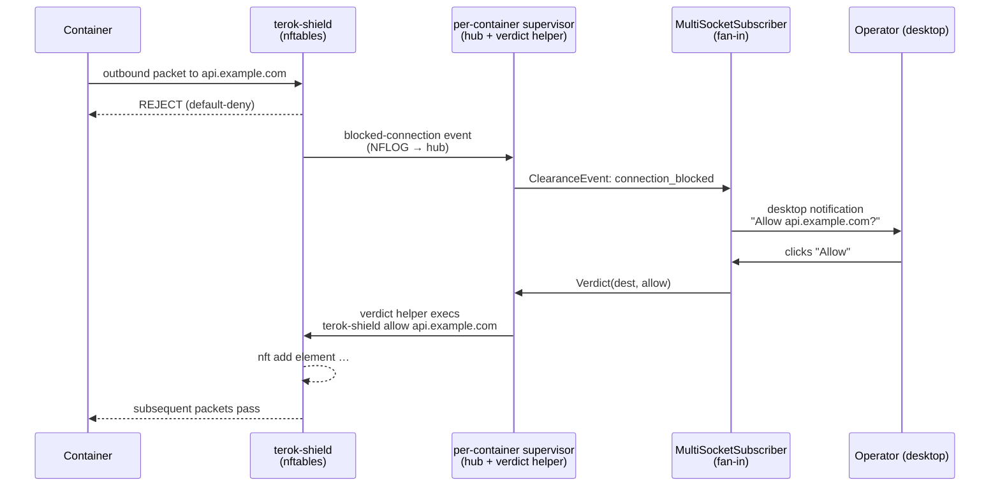

# terok-clearance

Live allow/deny prompts for [terok-shield](https://github.com/terok-ai/terok-shield),
[terok](https://terok-ai.github.io/terok/)'s egress firewall — a per-container
varlink hub and verdict helper, fanned into desktop notifications.

When a hardened terok container hits a blocked outbound destination,
the operator sees a desktop notification with **Allow** and **Deny**
buttons; the chosen verdict is written into the running nftables
ruleset.  No restart, no shell into the container, no editing config
files.


## What is the clearance system

The clearance system is the operator-in-the-loop decision path for
terok's egress firewall.  Each hardened container runs its own
**supervisor** (provided by terok-sandbox) that composes two
varlink components in-process — the **hub** (event bus) and the
**verdict helper** (the `terok-shield allow|deny` exec path) — on a
per-container Unix socket.  Operator UIs fan every supervisor's
event stream into one place and surface decisions through the
freedesktop Notifications D-Bus interface:



The per-container layout is deliberate.  Each supervisor owns one
container's hub and verdict helper, so a container's lifecycle,
sockets, and privileged exec surface stay isolated from every other
container.  Within a supervisor the **hub** is the event bus and the
only stateful component; its socket is bound same-UID-only (mode
0600) and every verdict must cite a triple the hub itself emitted.  The
**verdict helper** is the only piece that execs into the container's
shield, so it is held to one stateless method and isolated from the
receive path.  On the operator side, a single **notifier** is a thin
desktop bridge that fails gracefully on headless hosts, and
[`MultiSocketSubscriber`][terok_clearance.MultiSocketSubscriber]
multiplexes across every per-container hub socket so the operator
sees one merged stream.

## Key properties

- **Async-first** — built on `dbus-fast` with native asyncio
- **Action buttons** — notifications carry interactive actions
  (Allow / Deny)
- **Signal handling** — listen for `ActionInvoked` and
  `NotificationClosed`
- **Graceful fallback** — `create_notifier()` returns a silent
  `NullNotifier` when D-Bus is unavailable (headless, container, CI)
- **Protocol-based** — consumers type-hint against `Notifier`
  (PEP 544 Protocol)

## Quick start

### Install

```bash
pip install terok-clearance
```

### Send a notification

```python
import asyncio
from terok_clearance import create_notifier

async def main():
    notifier = await create_notifier(app_name="terok")
    action_received = asyncio.Event()

    def on_action(action_key):
        print(action_key)
        action_received.set()

    nid = await notifier.notify(
        "Clearance request",
        "Task alpha wants access to api.github.com:443",
        actions=[("allow", "Allow"), ("deny", "Deny")],
    )
    await notifier.on_action(nid, on_action)

    await action_received.wait()
    await notifier.disconnect()

asyncio.run(main())
```

### CLI tool (development / testing)

```bash
terok-clearance-hub notify "Title" "Body"   # one-shot desktop notification
terok-clearance-hub serve                   # run a clearance hub
terok-clearance-hub serve-verdict           # run the verdict helper
terok-clearance-hub clearance               # interactive terminal UI
```

## API preview

| Symbol | Description |
|--------|-------------|
| `create_notifier()` | Async factory — returns `DbusNotifier` or `NullNotifier` |
| `DbusNotifier` | Real D-Bus client via `dbus-fast` |
| `NullNotifier` | No-op fallback (all methods return immediately) |
| `Notifier` | PEP 544 Protocol for consumer type hints |
| `ClearanceHub`, `ClearanceClient`, `EventSubscriber` | Varlink hub + subscriber API |
| `MultiSocketSubscriber` | Fan-in subscriber across every per-container hub socket |
| `VerdictServer` | Embeddable verdict-helper varlink server (composed by the supervisor) |

## Next steps

- [Contributing](developer.md) — development setup and conventions
- [API Reference](reference/) — full module documentation
